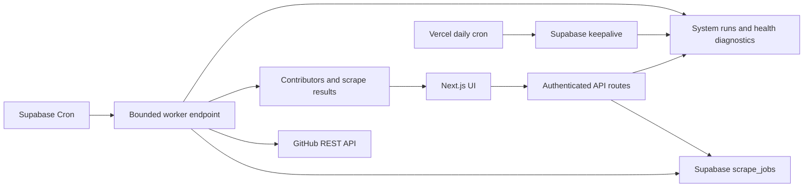

# Talon

Talon is a contributor-intelligence platform for technical recruiting and
ecosystem discovery. It finds the engineers actually building public software,
enriches their GitHub profiles with contact signals, and turns open-source
activity into a searchable sourcing workflow.


## The product

Recruiting tools usually begin with resumes, LinkedIn profiles, or keyword
matching. Talon begins with contribution activity:

- Analyze a GitHub repository or organization.
- Rank contributors by contribution depth.
- Enrich public profiles with email, LinkedIn, X, website, bio, company, and
  location signals.
- Group related scrapes into technical ecosystems.
- Track outreach status, notes, reminders, and follow-ups.
- Watch repositories for newly active contributors.

The deployed portfolio version is operator-controlled. It demonstrates the
complete workflow without presenting itself as a billing-ready customer SaaS.


The production deployment is intentionally access-controlled. Reviewers can
follow the [five-minute demo](docs/demo.md), or use the screenshots below to
inspect the core workflow without receiving an account.

## Architecture



Starting or retrying a scrape only validates the command and updates the durable
queue. Both return promptly; a best-effort post-response dispatch starts work
immediately, while Supabase Cron provides the recovery path. Workers atomically
claim the oldest due job with row locking that skips work already being claimed,
so simultaneous invocations remain useful without double-processing. Repository
discovery, organization repository scanning, and contributor hydration persist
their cursors between invocations, so work can resume after a timeout without
duplicating contributors.

Repository contributor discovery and organization repository enumeration
checkpoint every GitHub result page. Worker GitHub calls use short attempts and
delegate retry delays to the durable queue, keeping an individual serverless
invocation bounded even for very large repositories and organizations.

## Engineering decisions

### Durable background work

Vercel request duration is not treated as a job runner. Each bounded worker step
scans one GitHub result page, scans one organization repository, or hydrates one
twenty-profile batch. The invocation repeats steps only within its execution
budget, persists progress, and requeues unfinished work. Locks older than ten
minutes are recovered automatically.

### Server-managed credentials

`GITHUB_TOKEN`, Supabase keys, and cron credentials remain server-side. Tokens
never enter browser storage, scrape-job state, operational details, or API
responses.

Public scrape links use random bearer tokens that are shown only when a link is
created; Supabase stores their SHA-256 hashes. Links expire after 1, 7, or 30
days, can be revoked immediately, and expose public profile/contact fields only.
Recruiter notes, outreach status, reminders, errors, and team identifiers are
excluded from the public response.

### Free-tier operations

The portfolio deployment favors free infrastructure:

- Supabase Cron and `pg_net` schedule bounded worker requests.
- Vercel Cron performs a daily external keepalive.
- The keepalive also applies documented retention windows to operational data.
- The keepalive evaluates the seven-day scrape SLO and sends a state-change
  Slack alert for a new breach or recovery when `SLACK_WEBHOOK_URL` is set.
- `system_runs` preserves operational outcomes beyond Vercel Hobby log
  retention.
- Request IDs connect sanitized JSON logs to audit events, queue jobs, job
  events, and scheduled system runs without recording repository or contributor
  data in logs.
- The admin Health panel reports scheduler freshness, queue age, stale locks,
  failures, database connectivity, GitHub rate limits, and seven-day repository
  scrape reliability/latency SLOs.

The tradeoff is throughput: one bounded job step runs per scheduled invocation.
This is appropriate for a portfolio deployment, not a formal high-volume SLA.

### Idempotency and recovery

Starting a scrape atomically creates its scrape, queue job, optional project
link, and initial event. Browser and network retries reuse the original durable
resources through a team-scoped idempotency key. Contributor totals use
job-scoped upserts. Persisted contributors are skipped
when a hydration step resumes. GitHub rate-limit failures use delayed retries,
manual cancellation is checked between steps, and terminal failures remain
visible with their recent job events. Yield, failure, completion, cancellation,
manual retry, and stale-lock recovery use row-locked database transactions, so
a canceled job or newer worker lease cannot be overwritten by an older worker.
Cursor and progress checkpoints enforce that same lease before updating either
the queue job or its parent scrape.

## Stack

- Next.js 15, React 19, TypeScript
- Supabase Postgres, Auth, RLS, Vault, Cron, and `pg_net`
- GitHub REST API
- Tailwind CSS and shadcn/ui
- Vercel
- Node test runner, ESLint, and GitHub Actions

## Local setup

Requirements: Node.js 22 and pnpm 9.

```bash
pnpm install
cp .env.example .env.local
```

Configure:

```text
NEXT_PUBLIC_SUPABASE_URL
NEXT_PUBLIC_SUPABASE_ANON_KEY
SUPABASE_SERVICE_ROLE_KEY
TALON_ADMIN_PASSWORD
TALON_SESSION_SECRET
CRON_SECRET
GITHUB_TOKEN
```

Apply every SQL migration in `db/migrations` in numeric order, then start Talon:

```bash
pnpm migrations:check
pnpm dev
```

Starting with migration `027`, Talon records its database schema version. The
admin Production Readiness panel compares Production with the version required
by the deployed application and blocks health when migrations are missing.

Open [http://localhost:3000](http://localhost:3000).

For Production, configure the bounded worker by following
[docs/supabase-worker-schedule.md](docs/supabase-worker-schedule.md).

## Reproducible demonstration

The canonical demo uses the public `expressjs/express` repository. It covers
queue creation, background progress, contributor filtering, CSV export,
read-only sharing, and the production health panel. Counts and timings can
change as GitHub activity changes.

Follow the complete [five-minute demo runbook](docs/demo.md).


Only public GitHub data should be used in portfolio demonstrations. Do not
publish recruiter notes, private repositories, secrets, or personal contact
exports.

## Quality and release workflow

```bash
pnpm verify
pnpm build
```

CI runs whitespace checks, lint, TypeScript, tests, and the production build on
every pull request. Production changes use `.github/pull_request_template.md`
to document ownership, rollback, migrations, environment changes, and smoke
results.

Local read-only smoke:

```bash
ADMIN_PASSWORD="..." pnpm smoke:local
```

Production end-to-end scrape smoke:

```bash
BASE_URL="https://your-domain.example" \
ADMIN_EMAIL="owner@example.com" \
ADMIN_PASSWORD="..." \
SMOKE_REPO="octocat/Hello-World" \
pnpm smoke:production
```

The production smoke verifies health and recent scheduler activity, then tests
cancel, retry, completion, contributor loading, CSV generation, and public
read-only sharing. It deletes the test scrapes and cascading share link when it
finishes. Set `KEEP_SMOKE_ARTIFACTS=true` only when you intentionally want to
inspect them afterward.

To invoke and verify `/api/keepalive` directly in addition to checking its
persistent health history, provide the production cron secret:

```bash
CRON_SECRET="..." pnpm smoke:production
```

Useful tuning variables are `SMOKE_CANCEL_REPO`, `POLL_SECONDS`, and
`MAX_POLLS`. Use only public GitHub repositories for smoke checks.

## Operations and security

- [Operations runbook](docs/ops.md)
- [Dependency and CI security](docs/dependency-security.md)
- [Supabase worker schedule](docs/supabase-worker-schedule.md)
- [Production follow-ups](PRODUCTION_TODO.md)
- [Multi-user design notes](docs/multi-user-phase2.md)

Supabase RLS is enabled for private tables, server routes use the service role,
sessions are signed and HTTP-only, every API request rechecks the user's current
team role, login attempts are rate limited, cron routes require bearer
authentication, browser writes enforce same-origin requests, security headers
limit browser capabilities, and correlated operational logs redact secrets,
URLs, repository targets, and contributor identifiers.
Role changes and team removals therefore take effect without waiting for a
session to expire.

## Deliberately deferred

Billing, self-serve customer onboarding, formal SLAs, high-volume worker
parallelism, and advanced contributor scoring are outside this portfolio
release. The next product experiments are relationship mapping, ecosystem graph
visualization, contributor migration tracking, and AI-assisted recruiting
workflows.
