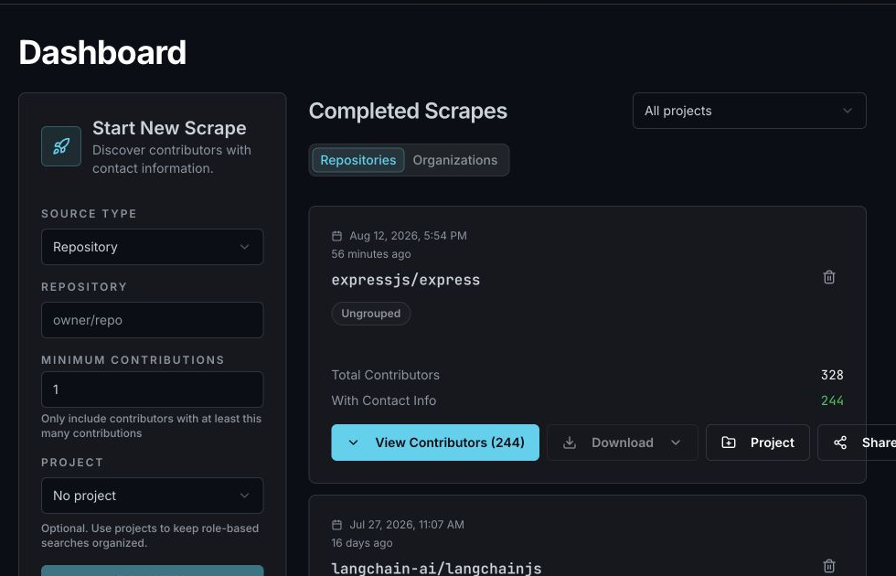
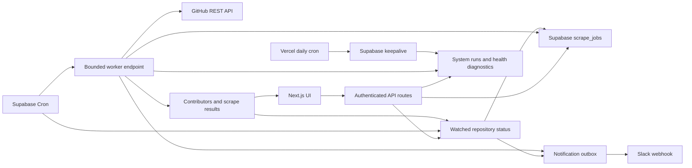
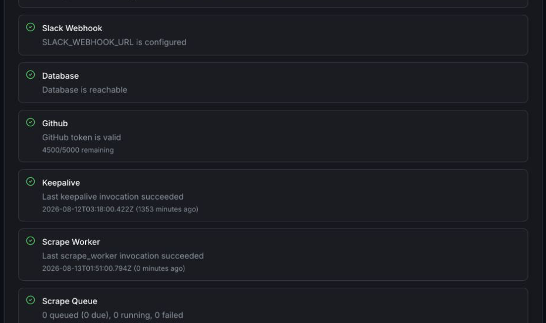

# Talon

Talon is a contributor-intelligence platform for technical recruiting and
ecosystem discovery. It finds the engineers actually building public software,
enriches their GitHub profiles with contact signals, and turns open-source
activity into a searchable sourcing workflow.


## The product

Recruiting tools usually begin with resumes, LinkedIn profiles, or keyword
matching. Talon begins with contribution activity:

- Analyze a GitHub repository or organization.
- Rank contributors by contribution depth.
- Enrich public profiles with email, LinkedIn, X, website, bio, company, and
  location signals.
- Group related scrapes into technical ecosystems.
- Track outreach status, notes, reminders, and follow-ups.
- Watch repositories for newly active contributors.

The deployed portfolio version is operator-controlled. It demonstrates the
complete workflow without presenting itself as a billing-ready customer SaaS.
Self-service registration is closed by default; existing users can sign in and
admins can provision additional accounts without exposing the shared GitHub API
capacity to anonymous account creation.



The production deployment is intentionally access-controlled. Reviewers can
follow the [five-minute demo](docs/demo.md), or use the screenshots below to
inspect the core workflow without receiving an account.

## Architecture



Starting or retrying a scrape only validates the command and updates the durable
queue. Both return promptly; a best-effort post-response dispatch starts work
immediately, while Supabase Cron provides the recovery path. Workers atomically
claim the oldest due job with row locking that skips work already being claimed,
so simultaneous invocations remain useful without double-processing. One worker
can drain up to five jobs that finish quickly, while all jobs share one
forty-second time budget and one twenty-step GitHub budget. Repository and
organization discovery plus contributor hydration persist their cursors between
invocations, so work can resume after a timeout without duplicating contributors.

Repository contributor discovery and organization repository enumeration
checkpoint every GitHub result page. Organization contributor pages are staged
by repository and atomically added to the job total only after that repository's
final page, making retries safe without holding a repository in memory. Worker
GitHub calls use short attempts and delegate retry delays to the durable queue,
keeping an individual serverless invocation bounded even for very large
repositories and organizations.

Contributor profile hydration is cached per team for seven days using a
dedicated GitHub-profile freshness timestamp. Overlapping scrapes can therefore
reuse recently fetched public profile and contact data without extending the
cache when a recruiter edits notes, status, reminders, or outreach fields.

Watched repositories use the same bounded queue rather than a second long-lived
request path. Each minute, the scheduler atomically enqueues checks whose chosen
interval has elapsed. Manual checks return `202` immediately, progress and
outcomes are stored in Supabase, and interrupted work resumes like any other
scrape. These internal checks are excluded from ordinary scrape history and SLO
metrics while remaining visible on the Watched Repos screen.

## Engineering decisions

### Durable background work

Vercel request duration is not treated as a job runner. Each bounded worker step
scans one GitHub result page or hydrates one twenty-profile batch. The invocation
repeats steps only within its execution budget, persists progress, and requeues
unfinished work. Locks older than ten minutes are recovered automatically.

### Server-managed credentials

`GITHUB_TOKEN`, Supabase keys, and cron credentials remain server-side. Tokens
never enter browser storage, scrape-job state, operational details, or API
responses.

### Fail-closed workspace scope

Authenticated routes resolve the caller's live workspace membership before
accessing data. Because the server-side Supabase client intentionally uses the
service role and bypasses RLS, database helpers never infer or substitute the
shared default workspace. A missing workspace identifier stops the operation
before any query runs; only the explicit break-glass admin context may resolve
the default workspace.

### Closed registration

Production signup is disabled unless the server-only
`TALON_SELF_SERVICE_SIGNUP_ENABLED` setting is explicitly `true`. The login page
does not advertise workspace creation while registration is closed, and the API
independently rejects direct signup requests before touching Supabase Auth.
Existing users and accounts provisioned by an administrator are unaffected.

Public scrape links use random bearer tokens that are shown only when a link is
created; Supabase stores their SHA-256 hashes. Links expire after 1, 7, or 30
days, can be revoked immediately, and expose public profile/contact fields only.
Recruiter notes, outreach status, reminders, errors, and team identifiers are
excluded from the public response.

### Free-tier operations

The portfolio deployment favors free infrastructure:

- Supabase Cron and `pg_net` schedule bounded worker requests.
- Vercel Cron performs a daily external keepalive.
- The keepalive also applies documented retention windows to operational data.
- The complete Postgres inventory, privacy classifications, deletion boundaries,
  and non-database limitations live in
  [`docs/data-lifecycle.md`](docs/data-lifecycle.md); CI requires every new table
  to receive an explicit lifecycle decision.
- The keepalive evaluates the seven-day scrape SLO and sends a state-change
  Slack alert for a new breach or recovery when `SLACK_WEBHOOK_URL` is set.
- `system_runs` preserves operational outcomes beyond Vercel Hobby log
  retention.
- Request IDs connect sanitized JSON logs to audit events, queue jobs, job
  events, and scheduled system runs without recording repository or contributor
  data in logs.
- Internal API failures return a stable public message and correlation request
  ID; database, provider, stack, and credential details remain only in sanitized
  server logs.
- Authentication, profile, teammate-management, authorization, and Slack test
  failures use the same structured redaction boundary; raw provider error
  objects are never written directly to production logs.
- Scrape queues, dashboard lists, GitHub-capacity checks, and watched-repository
  operations follow that boundary too, including development payload metrics.
- The admin Health panel reports scheduler freshness, queue age, stale locks,
  scrape and notification-delivery failures, database connectivity, GitHub rate
  limits, and seven-day repository scrape reliability plus separate queue-start,
  processing, and end-to-end latency evidence.

The tradeoff is throughput: workers drain only a small bounded batch and stop
after the first yielded or failed job. This is appropriate for a portfolio
deployment, not a formal high-volume SLA.

### Idempotency and recovery

Starting a scrape atomically creates its scrape, queue job, optional project
link, and initial event. Browser and network retries reuse the original durable
resources through a team-scoped idempotency key. Contributor totals use
job-scoped upserts. Hydrated profiles, scrape links, real progress, and their
event commit atomically after the active worker lease is rechecked; persisted
contributors are skipped when a hydration step resumes. GitHub rate-limit
failures activate one durable token-wide cooldown, so every worker pauses until
GitHub's requested reset instead of consuming each queued job's attempts.
Manual cancellation is checked between steps, and
terminal failures remain visible with their recent job events. Yield, failure,
completion, cancellation, manual retry, and stale-lock recovery use row-locked
database transactions, so a canceled job or newer worker lease cannot be
overwritten by an older worker. Cursor and progress checkpoints enforce that
same lease before updating either the queue job or its parent scrape. Completion
is database-authoritative: Talon verifies the exact eligible candidate/link set,
derives contributor and contact totals, and commits the terminal job, scrape,
event, and activity notification together.

Watched-repository Slack alerts use a transactional outbox. The same database
transaction that records newly detected contributors creates one deduplicated,
secret-free delivery record. The existing one-minute worker claims deliveries
with leases, uses exponential retry backoff, recovers stale claims, and stops
after five failed attempts. Slack webhooks do not provide an idempotency key, so
delivery is intentionally at-least-once: a process interruption after Slack
accepts a message but before Talon records success can rarely produce a
duplicate, but cannot silently lose the alert.

Workspace deletion uses the same recovery discipline for external Storage.
The database transaction that removes a workspace first creates a private
profile-photo cleanup task. An immediate bounded attempt handles the common
case, while the one-minute worker atomically claims retries, recovers stale
leases, applies bounded backoff, and exposes terminal failures in health
diagnostics. Object paths never enter browser responses or logs.

## Stack

- Next.js 15, React 19, TypeScript
- Supabase Postgres, Auth, RLS, Vault, Cron, and `pg_net`
- GitHub REST API
- Tailwind CSS and shadcn/ui
- Vercel
- Node test runner, ESLint, and GitHub Actions

## Local setup

Requirements: Node.js 22 and pnpm 9.

```bash
pnpm install
cp .env.example .env.local
```

Configure:

```text
NEXT_PUBLIC_SUPABASE_URL
NEXT_PUBLIC_SUPABASE_ANON_KEY
SUPABASE_SERVICE_ROLE_KEY
TALON_ADMIN_PASSWORD
TALON_SESSION_SECRET
CRON_SECRET
GITHUB_TOKEN
```

Self-service workspace creation is optional and closed by default. Enable it
only for an intentional rollout:

```text
TALON_SELF_SERVICE_SIGNUP_ENABLED=true
```

Apply every SQL migration in `db/migrations` in numeric order, then start Talon:

```bash
pnpm migrations:check
pnpm dev
```

Starting with migration `027`, Talon records its database schema version.
Migration `043` also attests the physical schema contract: critical tables,
columns, functions, validated workspace constraints, and row-level-security
settings must actually exist. The admin Production Readiness panel blocks
health when either the version or those required objects are missing.

Open [http://localhost:3000](http://localhost:3000).

For Production, configure the bounded worker by following
[docs/supabase-worker-schedule.md](docs/supabase-worker-schedule.md).

## Reproducible demonstration

The canonical demo uses the public `expressjs/express` repository. It covers
queue creation, background progress, contributor filtering, CSV export,
read-only sharing, and the production health panel. Counts and timings can
change as GitHub activity changes.

Follow the complete [five-minute demo runbook](docs/demo.md).



Only public GitHub data should be used in portfolio demonstrations. Do not
publish recruiter notes, private repositories, secrets, or personal contact
exports.

## Quality and release workflow

```bash
pnpm verify
pnpm build
pnpm test:e2e
```

CI runs whitespace checks, lint, TypeScript, tests, the production build, and a
fresh Supabase database migration on every pull request. The disposable database
then exercises stale-worker handoff, idempotent hydration replay, cancellation,
global GitHub cooldown, and workspace-scoped claims through the real transition
functions; its concise trace is retained for seven days. A separate Chromium
job exercises the critical browser workflow from login through scrape queueing,
background completion, contributor inspection, and CSV export using a
deterministic API fixture. Controlled failure scenarios also verify that active
scrape progress and Pipeline views preserve their last valid snapshot and recover
through the visible Retry action. Browser tests never read or mutate production. The database job
converts the canonical `db/migrations` files into Supabase CLI filenames in a
temporary directory, then executes the complete sequence against Supabase's
local database image. Production changes use `.github/pull_request_template.md`
to document ownership, rollback, migrations, environment changes, and smoke
results.

Local read-only smoke:

```bash
ADMIN_PASSWORD="..." pnpm smoke:local
```

Production end-to-end scrape smoke:

```bash
BASE_URL="https://your-domain.example" \
ADMIN_EMAIL="owner@example.com" \
ADMIN_PASSWORD="..." \
SMOKE_REPO="octocat/Hello-World" \
pnpm smoke:production
```

The production smoke verifies health and recent scheduler activity, then tests
cancel, retry, completion, contributor loading, CSV generation, and public
read-only sharing. It deletes the test scrapes and cascading share link when it
finishes. Set `KEEP_SMOKE_ARTIFACTS=true` only when you intentionally want to
inspect them afterward.

To invoke and verify `/api/keepalive` directly in addition to checking its
persistent health history, provide the production cron secret:

```bash
CRON_SECRET="..." pnpm smoke:production
```

Useful tuning variables are `SMOKE_CANCEL_REPO`, `POLL_SECONDS`, and
`MAX_POLLS`. Use only public GitHub repositories for smoke checks.

## Operations and security

- [Product and engineering roadmap](docs/roadmap.md)
- [Operations runbook](docs/ops.md)
- [Disaster recovery](docs/disaster-recovery.md)
- [Capacity benchmark](docs/capacity-benchmark.md)
- [Dependency and CI security](docs/dependency-security.md)
- [Supabase worker schedule](docs/supabase-worker-schedule.md)
- [Production follow-ups](PRODUCTION_TODO.md)
- [Multi-user design notes](docs/multi-user-phase2.md)

Supabase RLS is enabled for private tables, server routes use the service role,
sessions are signed and HTTP-only, every API request rechecks the user's current
team role, login attempts are rate limited, cron routes require bearer
authentication, browser writes enforce same-origin requests, security headers
limit browser capabilities, and correlated operational logs redact secrets,
URLs, repository targets, and contributor identifiers.
Role changes and team removals therefore take effect without waiting for a
session to expire. Owners alone can manage teammate accounts; operational admins
cannot promote themselves or alter ownership. Database functions serialize
membership changes per team and refuse any concurrent transition that would
leave a team without an owner.

Audit events derive their actor from the authenticated request, distinguish
scheduled runs from human actions, and attach a one-way user identifier for
team-user traceability without storing an email address in the event ledger.
Audit and scrape-job history are append-only to the application role; the
database-owned retention function remains the only routine deletion path.
Signed sessions use strict versioned claims, bounded issuance and expiry times,
and a unique random session identifier. Unknown or incomplete actor claims are
rejected rather than falling through to privileged access. A private server-side
registry makes logout immediately revoke the current session and password changes
revoke every session for that user; only keyed identity hashes are persisted.
Settings lets each account review its active session start and expiry times,
revoke an individual older session, or sign out every other browser at once.
The database atomically caps each account at ten active sessions and retires the
oldest session when concurrent logins would exceed that bound.

## Deliberately deferred

Billing, self-serve customer onboarding, formal SLAs, high-volume worker
parallelism, and advanced contributor scoring are outside this portfolio
release. The next product experiments are relationship mapping, ecosystem graph
visualization, contributor migration tracking, and AI-assisted recruiting
workflows.
