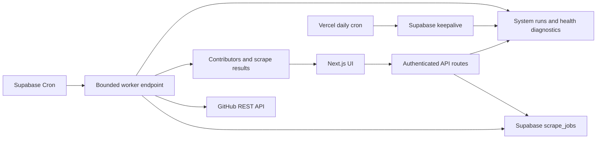

# Talon

Talon is a contributor-intelligence platform for technical recruiting and
ecosystem discovery. It finds the engineers actually building public software,
enriches their GitHub profiles with contact signals, and turns open-source
activity into a searchable sourcing workflow.


## The product

Recruiting tools usually begin with resumes, LinkedIn profiles, or keyword
matching. Talon begins with contribution activity:

- Analyze a GitHub repository or organization.
- Rank contributors by contribution depth.
- Enrich public profiles with email, LinkedIn, X, website, bio, company, and
  location signals.
- Group related scrapes into technical ecosystems.
- Track outreach status, notes, reminders, and follow-ups.
- Watch repositories for newly active contributors.

The deployed portfolio version is operator-controlled. It demonstrates the
complete workflow without presenting itself as a billing-ready customer SaaS.

## Architecture



Starting a scrape only validates the target and creates a durable job. Supabase
Cron invokes one bounded step per minute. Repository discovery, organization
repository scanning, and contributor hydration persist their cursors between
invocations, so work can resume after a timeout without duplicating
contributors.

## Engineering decisions

### Durable background work

Vercel request duration is not treated as a job runner. Each worker invocation
does one repository-discovery step or one ten-profile hydration batch, persists
progress, and requeues unfinished work. Locks older than ten minutes are
recovered automatically.

### Server-managed credentials

`GITHUB_TOKEN`, Supabase keys, and cron credentials remain server-side. Tokens
never enter browser storage, scrape-job state, operational details, or API
responses.

### Free-tier operations

The portfolio deployment favors free infrastructure:

- Supabase Cron and `pg_net` schedule bounded worker requests.
- Vercel Cron performs a daily external keepalive.
- `system_runs` preserves operational outcomes beyond Vercel Hobby log
  retention.
- The admin Health panel reports scheduler freshness, queue age, stale locks,
  failures, database connectivity, and GitHub rate limits.

The tradeoff is throughput: one bounded job step runs per scheduled invocation.
This is appropriate for a portfolio deployment, not a formal high-volume SLA.

### Idempotency and recovery

Contributor totals use job-scoped upserts. Persisted contributors are skipped
when a hydration step resumes. GitHub rate-limit failures use delayed retries,
manual cancellation is checked between steps, and terminal failures remain
visible with their recent job events.

## Stack

- Next.js 15, React 19, TypeScript
- Supabase Postgres, Auth, RLS, Vault, Cron, and `pg_net`
- GitHub REST API
- Tailwind CSS and shadcn/ui
- Vercel
- Node test runner, ESLint, and GitHub Actions

## Local setup

Requirements: Node.js 22 and pnpm 9.

```bash
pnpm install
cp .env.example .env.local
```

Configure:

```text
NEXT_PUBLIC_SUPABASE_URL
NEXT_PUBLIC_SUPABASE_ANON_KEY
SUPABASE_SERVICE_ROLE_KEY
TALON_ADMIN_PASSWORD
TALON_SESSION_SECRET
CRON_SECRET
GITHUB_TOKEN
```

Apply every SQL migration in `db/migrations` in numeric order, then start Talon:

```bash
pnpm dev
```

Open [http://localhost:3000](http://localhost:3000).

For Production, configure the bounded worker by following
[docs/supabase-worker-schedule.md](docs/supabase-worker-schedule.md).

## Reproducible demonstration

1. Sign in as the operator.
2. In Settings, confirm GitHub and database checks are healthy.
3. Start a repository scrape for `vercel/next.js` with a minimum contribution
   threshold appropriate to the desired demo size.
4. Observe the job move through queued and running states while the browser is
   closed or refreshed.
5. Open the completed scrape, filter contributors by contact channel, inspect a
   contributor, update outreach state, and export CSV.
6. Open Settings again to show the worker run history and healthy queue.

Only public GitHub data should be used in portfolio demonstrations. Do not
publish recruiter notes, private repositories, secrets, or personal contact
exports.

## Quality and release workflow

```bash
pnpm verify
pnpm build
```

CI runs whitespace checks, lint, TypeScript, tests, and the production build on
every pull request. Production changes use `.github/pull_request_template.md`
to document ownership, rollback, migrations, environment changes, and smoke
results.

Local read-only smoke:

```bash
ADMIN_PASSWORD="..." pnpm smoke:local
```

Production end-to-end scrape smoke:

```bash
BASE_URL="https://your-domain.example" \
ADMIN_EMAIL="owner@example.com" \
ADMIN_PASSWORD="..." \
SMOKE_REPO="octocat/Hello-World" \
pnpm smoke:production
```

The production smoke verifies health and recent scheduler activity, then tests
cancel, retry, completion, contributor loading, CSV generation, and public
read-only sharing. It deletes the test scrapes and cascading share link when it
finishes. Set `KEEP_SMOKE_ARTIFACTS=true` only when you intentionally want to
inspect them afterward.

To invoke and verify `/api/keepalive` directly in addition to checking its
persistent health history, provide the production cron secret:

```bash
CRON_SECRET="..." pnpm smoke:production
```

Useful tuning variables are `SMOKE_CANCEL_REPO`, `POLL_SECONDS`, and
`MAX_POLLS`. Use only public GitHub repositories for smoke checks.

## Operations and security

- [Operations runbook](docs/ops.md)
- [Supabase worker schedule](docs/supabase-worker-schedule.md)
- [Production follow-ups](PRODUCTION_TODO.md)
- [Multi-user design notes](docs/multi-user-phase2.md)

Supabase RLS is enabled for private tables, server routes use the service role,
sessions are signed and HTTP-only, login attempts are rate limited, cron routes
require bearer authentication, and audit metadata intentionally excludes
secrets.

## Deliberately deferred

Billing, self-serve customer onboarding, formal SLAs, high-volume worker
parallelism, and advanced contributor scoring are outside this portfolio
release. The next product experiments are relationship mapping, ecosystem graph
visualization, contributor migration tracking, and AI-assisted recruiting
workflows.
